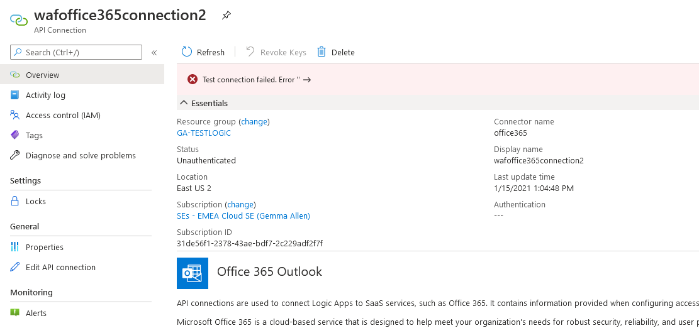
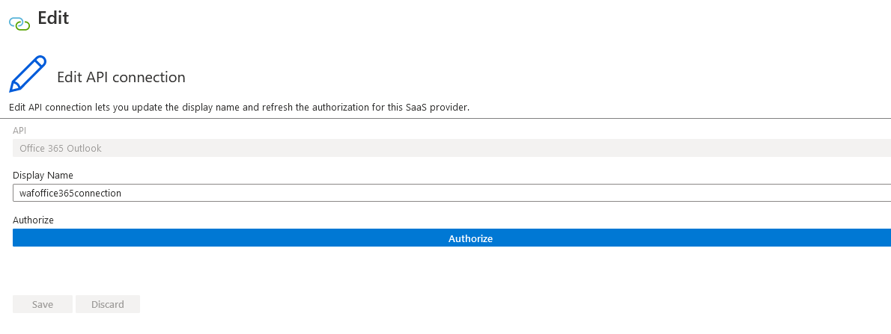
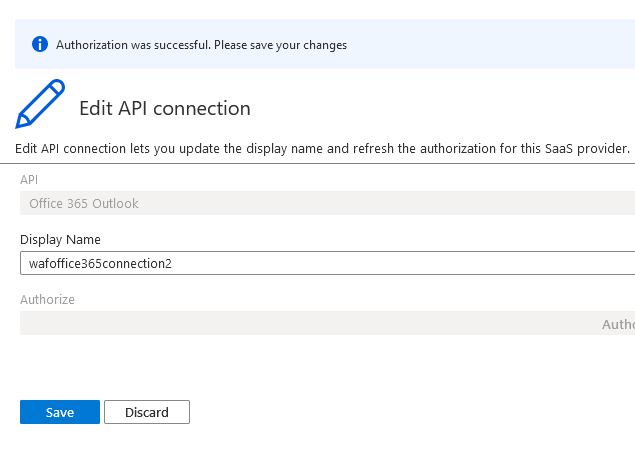
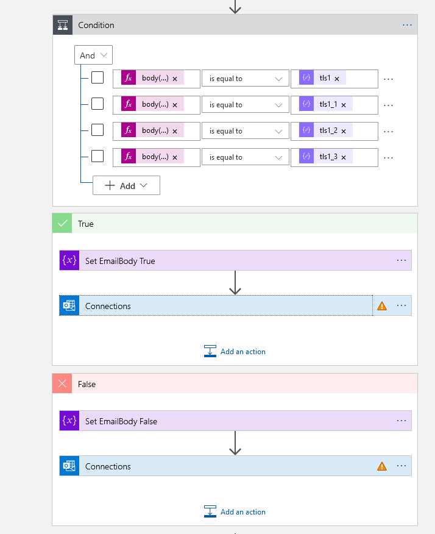
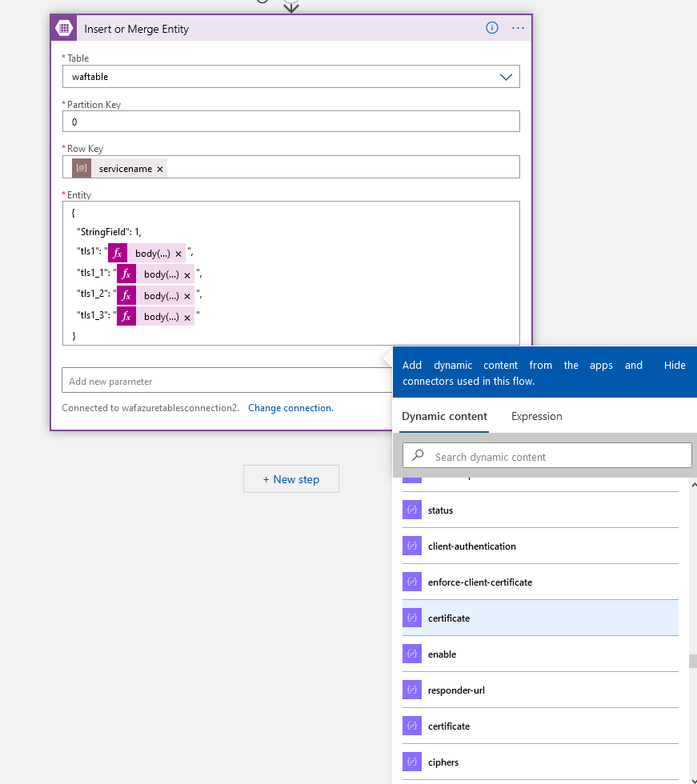

# Barracuda Web Application Firewall for Azure - Example of Logic App and API

## Introduction
This Azure Resource Manager template will deploy a logic App example that is using the WAF API to notify if certain settings have been changed.

In this example the *WAF's management API* is used to collect the details of a named service. 
The desired values of the service are collected from the API and selected by the logic app for comparison. In this example the logic app looks for the TLS versions that have been configured on the WAF's service and compares the current value against what was configured on the previous run. 

A table storage account is used to store the previous runs settings and on the first run the script will only be able to collect these settings. On it's second run it will perform a comparison. 

## Prerequisite
*To access the WAF management API securely your WAF management must be using a valid HTTPS certificate from a public certificate authority, it cannot be self-signed at this will not be trusted by the Logic App*

Logic Apps are not available for all regions, but do not need to be in the local region to the device. 
https://azure.microsoft.com/en-us/global-infrastructure/services/?products=logic-apps&regions=all

## Deployment

You can deploy from the Azure Portal using the provided link.

Following a succesful deployment if you wish this to send emails you will need to authorise the Office365 connection that is configured. To do this;
1. Go to the Resource Group you have deployed into
2. Click into the Office365 connection item.  
3. Within the connection you should receive a warning that the test connection has failed.  Click on the link it presents.
4. You will now be asked to Authorised the Office365 account, click on the Authorise button and complete the instructions to sign into Office365.  
5. Lastly if the authorisation was succesfull Save the changes. 

At this point you should based 

## Deployed resources
Following resources will be created by the template:
- One Azure Logic App
- One Azure Storage account with a single table store
- A Logic App Connector to the storage account
- A Logic App Connector to Office 365

## Customisation

The script is configured to email a notification out when it runs on if the settings have or haven't changed. You can use the Designer or Code view via the Azure portal to change the response, for example, you might delete the "Connections" item under the True response and have the Logic App take no action if no change is detected. 

You can edit the notification email content by changing the values within "Set EmailBody True" and "Set EmailBody False" sections. 

You can also customise the objects being compared, by editing the values in a few places. 
- You need to edit the Insert or Merge Entity as this writes to table storage the values collected from the WAF for the next comparison. In here, you can add fields to be written to table storage. Note the Row Key is the name of the service being collected. 
- You will also then need to edit the Get Enity which is what collects the information from table storage, not the Row Key which must match what you wrote and the Select Query which collects the names of the fields you defined in the Entity values. In this script we write the enable_tls_1 WAF value as the tls1 column in table storage.
- You will also need to edit the TableData as this defined the json schema taken from the Get Entity results. 
- Finally the Condition will need to be altered to conduct different comparisons.  
- Take a note of the existing syntax as to be able to handle a dynamic servicename the parameter needs be inserted via the code view. For example, if Peter is a new value being added note it has the value (underlined in red) `['service'] ` , whereas in the tls line this has been replaced with `[parameter('servicename')]` (underlined in green)
