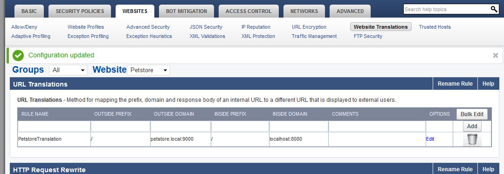

# Barracuda WAF-as-a-Service for Azure - Quickstart Lab with Vulnerable VM Apps

## Introduction
This Azure Resource Manager template will deploy a pair (or whatever number you request) of Barracuda Web Application Firewalls into their own Virtual Network with a 

## Prerequisites
The solution does a check of the template when you use the provided scripts. It does require that [Programmatic Deployment](https://azure.microsoft.com/en-us/blog/working-with-marketplace-images-on-azure-resource-manager/) is enabled for the Barracuda Web Application Firewall BYOL or PAYG images. Barracuda recommends use of **D**, **D_v2**, **F** or newer series. 

You can enable programatic deployment via Powershell using the Cloud Shell feature in the portal. Below are two powershell examples for byol and hourly, please adapt as required to your version of powershell and byol or hourly license requirement.

`Get-AzMarketplaceTerms -Publisher "barracudanetworks" -Product "waf" -Name "byol" | Set-AzMarketplaceTerms -Accept`
`Get-AzureRmMarketplaceTerms -Publisher "barracudanetworks" -Product "waf" -Name "hourly" | Set-AzureRmMarketplaceTerms -Accept`

'az vm image terms accept --urn barracudanetworks:waf:byol:*'

## Deployment

The package provides a deploy.ps1 and deploy.sh for Powershell or Azure CLI based deployments. This can be peformed from the Azure Portal as well as the any system that has either of these scripting infrastructures installed. Or you can deploy from the Azure Portal using the provided link.

## Deployed resources
Following resources will be created by the template:
- One Azure VNET with 2 subnets (1 for the WAF and a second for the web server)
- One external Basic Azure Load Balancer containing the deployed virtual machines with a public IP and services for HTTP, HTTPS and ports listed below for each app.
- Both WAF systems are deployed in an Availability Set
- One Unbuntu web server with docker images deployed.

##Next Steps
After succesfull deployment you should be able to access the WAF via it's management GUI http://<LBPublicIP>:8001

## Post Deployment Configuration
Once provisioned you will be able to access via the DNS name or Public IP of the WAF's load balancer a series of websites designed to operate with poor security. 
These sites will allow you to test the WAF functionality. 

The Web Server will be present on the private IP of: 172.16.137.4

You will need to configure the WAF services to deliver the sites which are arranged on the linux web host as follows. 

| Application | Port | Example Path| More Info | 
|:------|:--------:|:--------|:--------|
|DVWA| 1000 | http://<publiclbip>:1000/login.php | http://www.dvwa.co.uk/ |
|Mutillidae | 2000 | http://<publiclbip>:2000/ |http://www.irongeek.com/i.php?page=mutillidae/mutillidae-deliberately-vulnerable-php-owasp-top-10 |
|WebGoat | 3000 | http://<publiclbip>:1000/ |https://owasp.org/www-project-webgoat/|
|BWAPP | 4000 | not currently loading | |
|JuiceShop | 5000 | not currently loading | https://owasp.org/www-project-juice-shop/|
|Altoro | 6001 | http://<publiclbip>:6001/ ||	
|HTTPBin | 7000 | not currently loading || 	
|Hackazon | 8000 | http://<publiclbip>:8000/ ||
|Petstore | 9000| http://<publiclbip>:9000/ ||

###Step 1
Configure the WAF services to deliver the sites.

There are a number of ways to configure the WAF's in Azure to deliver these services. 
- You could create a service per application on a different port
	
- You could create a single service and split the applications by hostname using content rules to direct traffic to different ports on the web server
	
- You could enable Azure Multi-IP and have each service running on different IP's but the same port

To assist in accessing you can add the following line to your hosts file: 
`
yourwafpublicip  dvwa.local mutillidae.local webgoat.local bwapp.local juiceshop.local altoro.local httpbin.local hackazon.local petstore.local
`

### Step 2 - Petstore
The Petstore site requires some additional setup in the WAF, to allow it to deliver it's content a Website Translation rule is required. The below is shown using the DNS name for the hostsfile but this could also be <publicip>:9000

